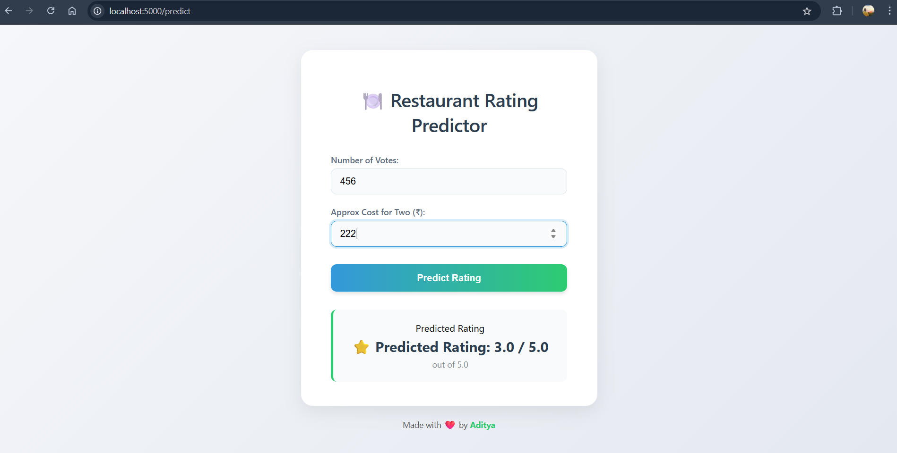

# 🍽️ Restaurant Rating Predictor

A simple machine learning web app built with **Flask** that predicts restaurant ratings based on:
- ✅ Number of votes
- ✅ Approximate cost for two people

---

## 📦 Dataset Source

This project uses the **Zomato Bangalore Restaurant Dataset**, which contains details like:
- Restaurant name, location
- Average cost, total votes
- Rating and delivery info

🗂️ We used only 3 columns for prediction:
- `votes`
- `approx_cost(for two people)`
- `rate`

---

## 🧠 Model Details

- 💡 Model Used: **Linear Regression**
- 🧼 Data Cleaning:
  - Removed `"NEW"` and `"-"` from ratings
  - Converted `approx_cost(for two people)` from string to float
- ✂️ Train-Test Split: 80% training, 20% testing
- 📦 Model Saved using: `pickle`

---

## 🖥️ Web Interface (Flask + HTML/CSS)

- Built using **Flask**
- UI is responsive and styled with **pure CSS**
- User can input:
  - 🔢 Total votes
  - 💸 Approx cost (₹) for two people

Upon submission, the model predicts a rating **out of 5.0** 🎯

---

## 📸 Demo Screenshot



---

## 🚀 How to Run Locally

```bash
git clone https://github.com/adityasharma18/Restraunt_Rating_Predictor.git
cd Restraunt_Rating_Predictor

# Create virtual environment
python -m venv venv
venv\Scripts\activate   # For Windows

# Install dependencies
pip install -r requirements.txt

# Run the app
python app.py
